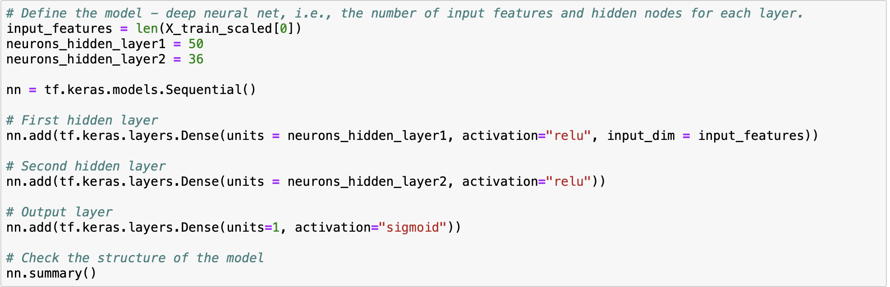
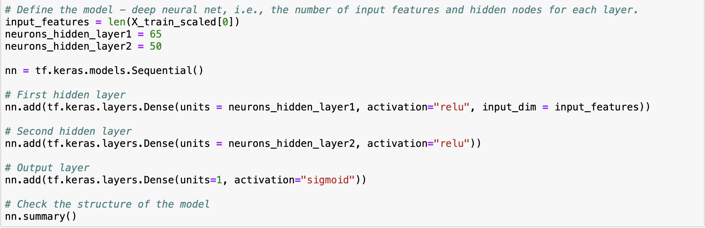
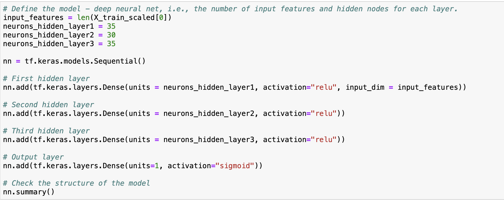
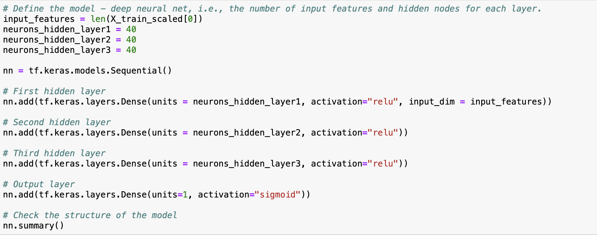

# Neural-Network Challenge

## **Overview**
The purpose of this challenge was to create a machine learning model that could help the nonprofit foundation Alphabet Soup identify and select promising funding applicants by predicting their success. The data provided is used to train and test the created model and contains organizations that have previously received funding from Alphabet Soup.

## **Results**

---

### Data Preprocessing
The target variable for this model is the "IS_SUCCESSFUL" column, while the others are the features. Both the "EIN" and "NAME" column were removed, as they did not have any relevant information for the analysis. 

### Compiling, Training, and Evaluating the Model
A total of four attempts were untaken to attempt to achieve the 75% accuracy. However, none of the models reached this level of accuracy. All models used "relu" as the activation function for the hidden layers and "sigmoid", as the activation function for the output layer, as these are good functions for binary classification problems. 

--- 

### **Models:**
The first model used two hidden layers with 50 and 36 neurons respectively and 100 training epochs. An accuracy of 73.56% was achieved. 

---

The following models all used a higher cutoff value for both the "APPLICATION_TYPE" and "CLASSIFICATION" bin. 

---

The second model additionally had increased neurons of 65 and 50 neurons and the training epochs were increased to 150. An accuracy of 72.43% was achieved. 

---

For the third model, an additional hidden layer was added and the neurons were 35, 30, and 35 respectively for each layer. The additional third layer also used "relu" as an activation function. The training epochs were also increased to 200. An accuracy of 72.33% was achieved. 

--- 

The fourth and final model only had an increased number of neurons and training epochs. The neurons were 40 for each hidden layer and training epochs were again increased to 250. An accuracy of 73.04% was achieved. 

## **Summary**
Overall, the first model actually had the best accuracy score, followed by the final, most "optimized" model. Interestingly, these models are also the most different. The first model had a hidden layer less, less neurons, lower training epochs, and more diverse data available. The fourth model had a third hidden layer, more neurons and training epochs, and was trained on more focused data. Seeing that the accuracy started to increase again after the second and third attempt, I would recommend to continue using a model with the additional layer and neurons. I would try to further optimize it with less training epochs, to not overfit the model and potentially also by withholding it less training data to diversify it more again. 